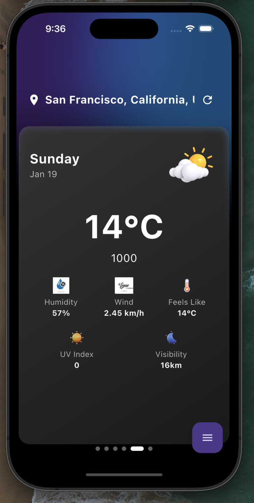
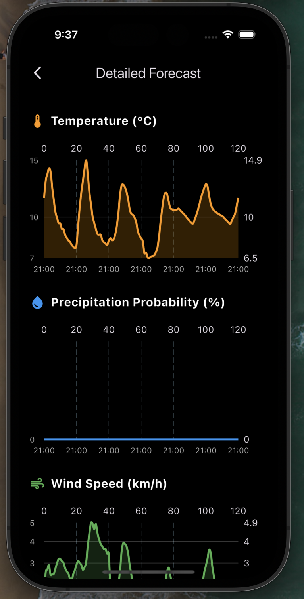
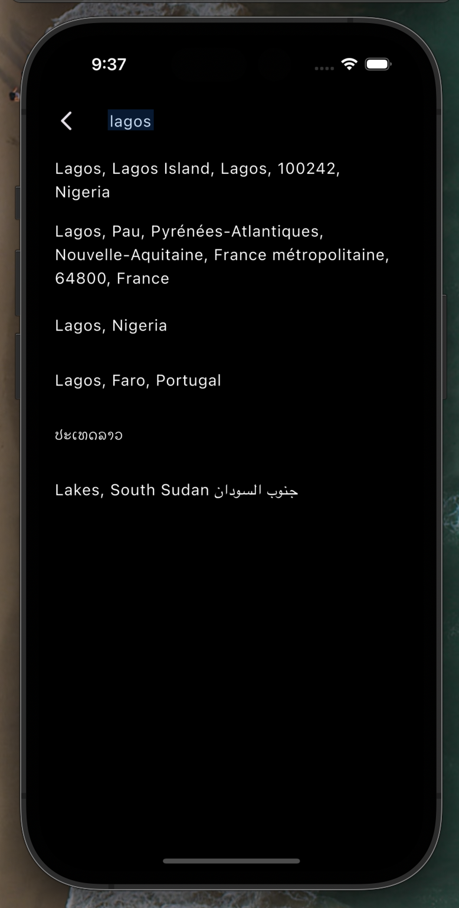

# Modern Weather App 🌦️


A sleek and modern weather application built with Flutter, featuring real-time weather updates, interactive charts, and a beautiful user interface. Get accurate weather forecasts with just a tap!

## ✨ Screenshots

<p align="center">
  
  &nbsp;&nbsp;&nbsp;&nbsp;
  
  &nbsp;&nbsp;&nbsp;&nbsp;
  
</p>

## 🚀 Key Features

### Core Functionality
- **Real-time Weather Data**: Up-to-the-minute weather information
- **Location-based Forecasts**: Automatic local weather detection
- **Global Search**: Find weather for any location worldwide
- **Detailed Analytics**: Interactive charts and statistics

### User Experience
- **Intuitive Interface**: Clean and modern design
- **Smooth Animations**: Fluid transitions and effects
- **Dark Mode**: Easy on the eyes at night
- **Responsive Design**: Works on all screen sizes

### Technical Features
- **Offline Support**: Cache for previous weather data
- **Push Notifications**: Weather alerts and daily forecasts
- **Widget Support**: Home screen weather widget
- **Settings Persistence**: User preferences saved locally

## 🛠️ Installation

### Prerequisites
- Flutter SDK (3.0.0 or higher)
- Dart SDK (2.17.0 or higher)
- Android Studio / VS Code
- Tomorrow.io API key

### Setup Steps

1. **Clone the Repository**
   ```bash
   git clone https://github.com/yourusername/weather_app.git
   cd weather_app
   ```

2. **Install Dependencies**
   ```bash
   flutter pub get
   ```

3. **Configure API Key**
   Create a `.env` file in the root directory:
   ```env
   API_KEY=your_tomorrow_io_api_key
   ```

4. **Run the App**
   ```bash
   flutter run
   ```

## 🏗️ Architecture

The app follows a clean architecture pattern with BLoC for state management:

## 📱 Tech Stack

- **State Management**: flutter_bloc
- **API Integration**: http
- **Location Services**: geolocator
- **Charts**: fl_chart
- **Local Storage**: shared_preferences
- **Notifications**: flutter_local_notifications

## 🤝 Contributing

Contributions are welcome! Please read our [Contributing Guidelines](CONTRIBUTING.md) first.

1. Fork the repository
2. Create your feature branch (`git checkout -b feature/AmazingFeature`)
3. Commit your changes (`git commit -m 'Add some AmazingFeature'`)
4. Push to the branch (`git push origin feature/AmazingFeature`)
5. Open a Pull Request

## 📄 License

This project is licensed under the MIT License - see the [LICENSE](LICENSE) file for details.

## 🙏 Acknowledgments

- Weather data provided by [Tomorrow.io](https://www.tomorrow.io)
- Location data from [OpenStreetMap](https://www.openstreetmap.org)
- Icons from [Material Design Icons](https://material.io/icons)

## 📱 Download

<p align="center">
  <a href="[Play Store Link]">
    
  </a>
  &nbsp;&nbsp;&nbsp;&nbsp;
  <a href="[App Store Link]">
    
  </a>
</p>

## 📞 Support

For support, email your-email@example.com or join our Slack channel.

---

<p align="center">
  Made with ❤️ by [Your Name]
</p>